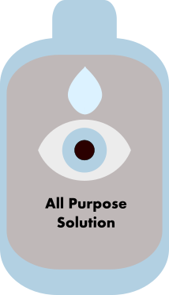

##**Note: All images in this guide were made by me in Inkscape (my first time using it so bear with me**#

#How to Put in Contact Lenses#
###Introduction###
Contact lenses can be a great alternative to wearing glasses every day! They don't fog up or fall off and keep your look the same if you aren't used to wearing glasses. However, they require some getting used to and are more prone to infection if used improperly. In this guide you will learn how to put in and take out contact lenses the safe and hygienic way.
###Step 1.) Wash your hands!
It is very important you wash your hands before putting in or removing contact lenses! For more information on how to wash your hands, see [this associated guide](http://www.wikihow.com/Wash-Your-Hands).

###Step 2.) Grab your contacts and solution
Gather your supplies, you will need prescription contact lenses and a good all-purpose contact lens solution. I recommend [Bausch and Lomb's Biotrue](http://www.amazon.com/s/?ie=UTF8&keywords=bausch%20&%20lomb%20biotrue&tag=mh0b-20&index=aps&hvadid=859489166&hvqmt=p&hvbmt=bp&hvdev=c&ref=pd_sl_9et56w2jfr_p). Make sure you have a sink and a mirror in front of you so you can rinse your contacts and see yourself!

     

###Step 3.) Rinse your lens
Take **one** lens out of its case/packaging. Make sure not to mix up left and right if your eyes have different prescriptions! Hold the lens gently between your thumb and index finger and rub it while rinsing it with solution.
###Step 4.) Inspect your contact lens
Before you try and stick the lens in your eye, you have to make sure it is in good condition to avoid eye irritation!

Hold the lens up level to your eye so you can see its shape. If the edges look like they curl outward the lens is inverted and won't sit on your eye properly! If it looks like a nice round bowl then it is properly oriented. 

Also make sure to notice any rips or contaminants. Don't use torn lenses as they will be *very* uncomfortable.

       

###Step 5.) Put the contact lens in
Now you are ready to put your lens in. Put the clean lens on the tip of your dominant hand's index finger. Put a couple drops of solution in the bowl of the lens and in your eye.

Using your other hand, pull your upper eyelid and eyelashes upward to open up your eye. While still holding the lens, use your bottom three fingers to pull your lower eyelid downward and expose your eye more.

Carefully and calmly move the lens on your index finger toward the center of your eye to avoid blinking. It may take a few tries so keep practicing!

**Tip:** If you accidentally drop the lens in the sink it's okay! Just rinse it thoroughly again and start from step 3.

###Step 6.) Make sure the lens is in right
After you successfully get the lens on your eye, avoid blinking for a few seconds so you don't dislodge it. Make sure it feels comfortable. If there is any discomfort, take the lens out (follow Step 8) and try again from step 3. There may be contaminants or your lens may be worn out!

###Step 7.) Put in your other lens
Repeat steps 3 through 6 with your other contact lens!

###Step 8.) Taking out your contact lenses
To take out your contact lenses first wash your hands (step 1) and follow the same procedure as in step 5 to pull back your eyelids and expose your eye. 

Using your thumb and index finger, gently grab at the center of your eye. You should break the lens' suction by bending it, don't worry, contacts are very flexible!

**Tip:** Contacts can cause discomfort if you wear them for too long! Additionally, some contacts ***cannot*** be slept in. Make sure to take out your lenses when you sleep or shower to avoid infection and discomfort.

###Step 9.) Storing your contact lenses
You can't just put your lenses in your case after taking them out! Clean your lens as in step 3, and then rinse it for an additional 3 seconds with solution.

Put the clean lens in your case and fill it with **clean, new solution**. Don't reuse old solution or water, it could cause infection! Your eyes are worth it.

Follow the lens manufacturer's recommended replacement schedule (daily, monthly, etc)

####That's it! Enjoy your glasses-free eyesight!

