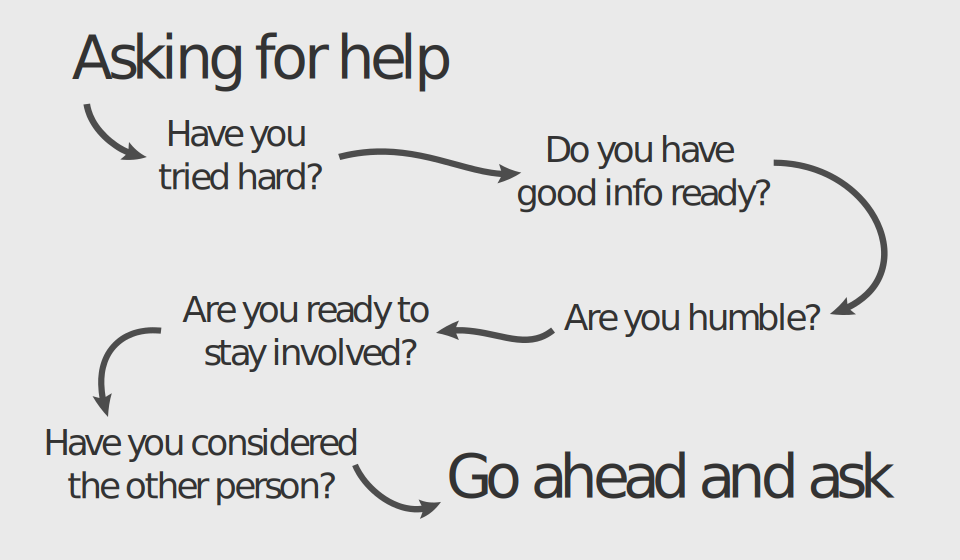

# Asking for Help

As people who create things, we occasionally create problems that we can not solve. And as humans, we often need others to assist us. Far too often we struggle on our own when we should not be ashamed to ask for help. It means we are humble enough to actually learn. And asking for help isn't lazy if done right. How can we do it right? I am glad you asked.

## Try First
Don't just ask for help the first moment you run into a problem. Try using some of your debugging knowledge to figure it out. A good rule of thumb is if you have not tried at least three debugging strategies, you have not tried hard enough. If you have done that, are out of options, and don't know what else to do, it is a good time to get help.

## Provide Good Info
Instead of plopping your circuit board that lost the magic smoke on someone's desk saying "What's wrong?!?!", collect your thoughts on what you know and your debugging attempts so far. Let them know under what circumstances the issue comes up and what you have already tried. This will save everyone time and frustration.

## Be Humble
I know that sometimes it is easy to try to validate yourself when getting help. We want it to be obvious that the problem is not with us, but with the thing we are working with. Just relax and take a breath. Focusing on your qualities will not help solve the problem.

## Participate
Once you have tried your hardest and then brought someone else in, stay involved. You will not learn anything if someone else fixes the problem while you were not looking. So make sure that you understand what they are doing. Also do what you can to help them out. If they need that screwdriver, pass it over and learn along the way.

## Be a Good Human
Be considerate. Ask yourself, "Is this person busy?" Be nice and polite. Be patient. And make sure they know that you appreciate them. If possible, try to make this a positive experience for everyone involved.

Image created by [Halcy Webster](https://github.com/halcyhoo) and can be reused under the [CC BY 4.0 license](https://creativecommons.org/licenses/by/4.0/)
