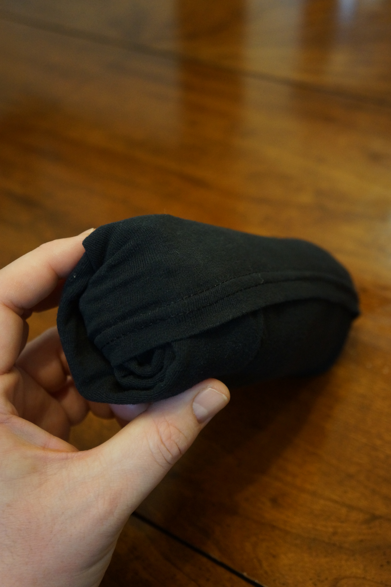

How to ~~Fold~~ Roll a Shirt
====================
Introduction
-----------------
This technique was inspired by guides posted on [Instructables.com](http://www.instructables.com/ "Instructables") (if you search for "ranger roll" you'll find a few variations).  It's excellent for travel, as it enables you to more efficiently use the precious space in your suitcase.  It can be used to store clothese at home, though there are some drawbacks to doing so which will be explained later.

Preparation
-----------

Make sure clothes are clean and dry.  Lay the shirt out flat facing up with the hem towards you and the neck away with the arms outstretched.

*photo by Sam Wizer*

Fold the Hem
------------------
Turn the bottom 3 inches or so of the shirt inside out and fold it back on itself.  This will be used to secure the roll in the last step.  For thicker shirts, you will want to make this fold a little bigger.

*photo by Sam Wizer*

To make sure that the fold is straight in the back, fold the bottom of the shirt away from you.

*photo by Sam Wizer*

After checking the fold along the back, fold the shirt down again with the top facing up and flat (with the exception of the fold at the bottom).

*photo by Sam Wizer*

Fold in Thirds
-------------------
Fold the right third of the shirt towards the center.

*photo by Sam Wizer*

Fold the right sleeve back across the fold you just made and lay it flat.

*photo by Sam Wizer*

Fold the left third over the top of the right, and fold the left sleeve in just as you had for the right side.

*photo by Sam Wizer*

Rotate
---------
Rotate the whole shirt 180&deg; so that the neck of the shirt is towards you.

*photo by Sam Wizer*

Roll
-----
Beginning at the neck, roll the shirt towards the hem, making it as tight as possible.

*photo by Sam Wizer*

Tuck
------
When you get to the end, pull  the fold of the hem back over the roll.  This will keep your shirt from unrolling.

*photo by Sam Wizer*

Store
-------
Pack your shirt away in your suitcase or drawer, but know that if you store the shirt rolled like this for a long time, you might end up with some weird creases.  Also, if you're looking for your tuxedo t-shirt, you might not be able to identify it without unrolling it.
