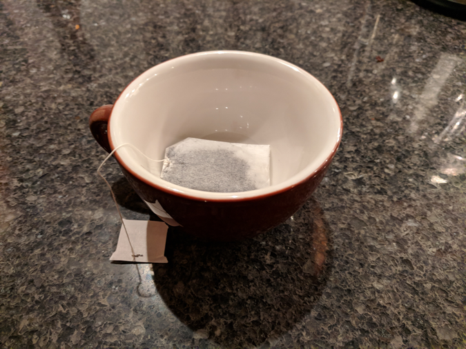
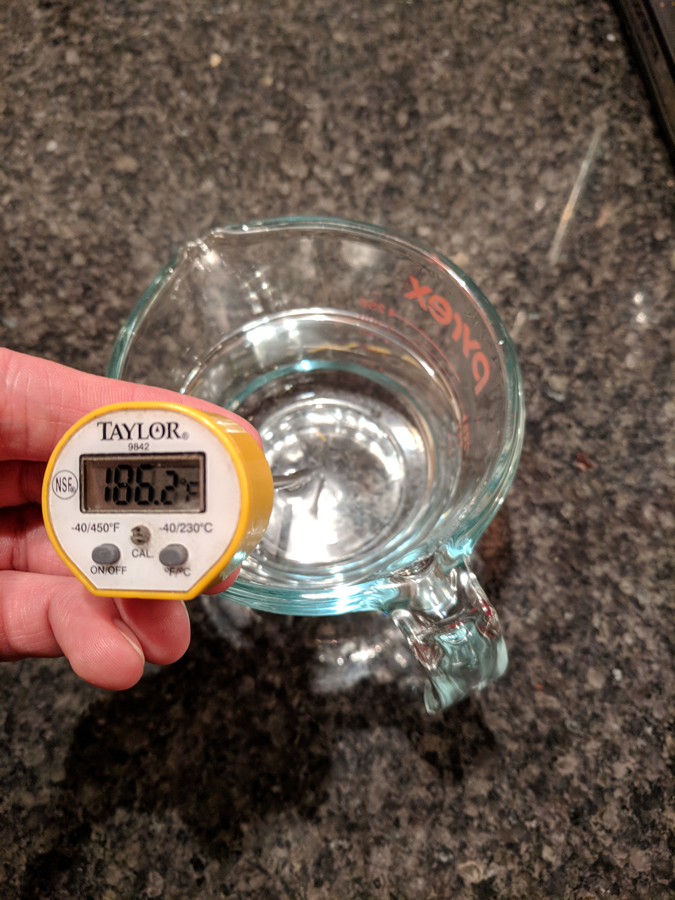
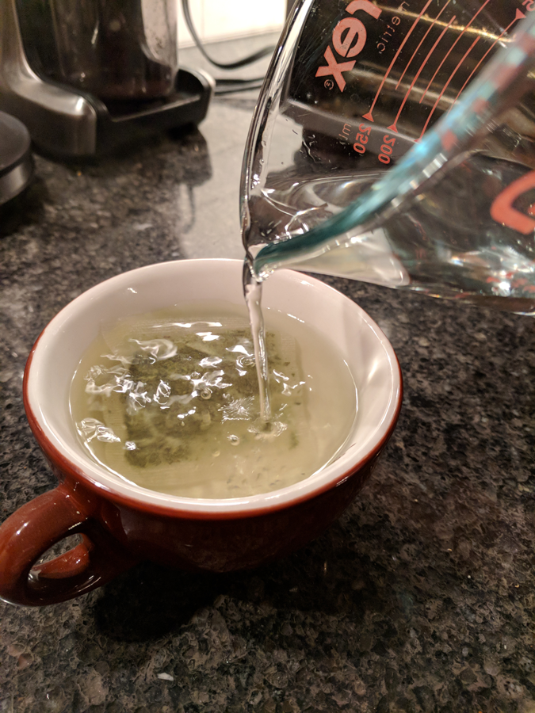
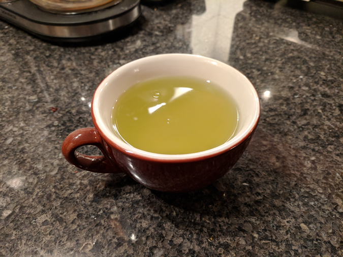

# Making Green Tea

Most people have made a cup of tea in their lives, and approximating the method usually produces a good cup of tea. 

However, sometimes a little specificity is good: green tea can become bitter if brewed with overly hot water. Follow these directions to brew a delicious cup.

### Materials

* Green tea (either in a bag, or loose leaf)
* Your favorite tea cup
* Kettle or microwave for heating tea
* Tea strainer (if loose leaf)

*optional items:*

* Thermometer
* Timer

### Steps

1. **Prepare your cup**

    Place your tea leaves in the cup. If you have a teabag, simply lay the teabag into the cup with the string and tag outside of the cup (see picture). If your tea is loose leaf, use the strainer as directed and fill it with about 1 tbsp. of tea leaves.

    
    
2. **Heat the water and let it cool**
    
     Heat the water to boiling. This can be done with a stovetop kettle, electric kettle, or even on a microwave with a suitable vessel. Once the water has boiled, let it cool! To be precise, it should be 185&deg;F or 85&deg;C for green tea (this is different for other tea varieties). Use a thermometer if you want, or simply wait about two minutes.
    
    

3. **Pour the water and steep**

    Once the water is about the right temperature, pour the water into the cup with the tea leaves. Then try to be patient as it brews! This takes two minutes. If you're feeling scientific, break out the timer -- but approximation will suffice.
   
   	
   
4. **Enjoy!**

    Remove the tea leaves (carefully, the water is still hot) from the cup. Rejoice! Your perfectly brewed cup of green tea has arrived.

    
 
 ---
 
*Notes* 

Brewing time and amount of leaves will vary to taste, but brewing temperature is less flexible. 

You can 're-infuse' your tea by introducing the leaves again a little later for the same amount of time. This can make the flavor deeper and more complex!
