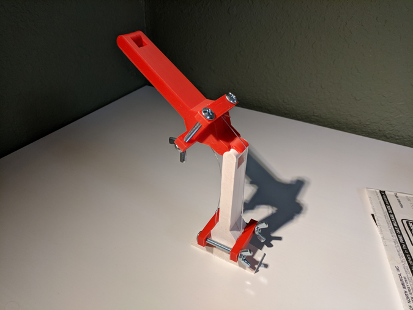

# Muscle Wire Explanation

I thought I would share a brief explanation of the model.

This was an armature I made while working with an experimental robotic actuator. It features a snap-together joint and surfaces for mounting the actuators.

